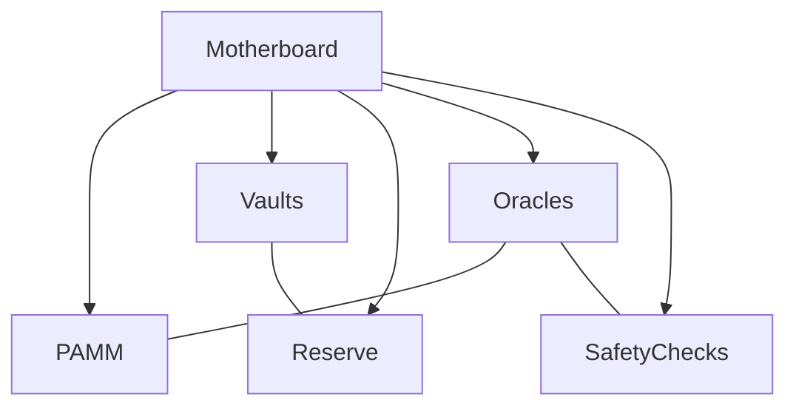

import { Callout, Steps, Step } from "nextra-theme-docs";

# High-Level Architecture

The Gyroscope protocol is designed with a modular architecture that enables flexibility and extensibility. At the core of the system is the **Motherboard**, which acts as the central coordinator, connecting the various components and managing the overall protocol functionality.

<Callout type="info">
The Motherboard contract is the entry point for users to interact with the Gyroscope protocol, handling tasks such as minting, redemption, and fee management.
</Callout>

The key components of the Gyroscope high-level architecture are:

- **PAMM (PrimaryAMMV1)**: The primary Automated Market Maker (AMM) contract that handles the pricing mechanism for the Gyroscope stablecoin, the GYD token.
- **Vaults**: These are the building blocks of the Gyroscope reserve, representing separate pools of liquidity that can hold different types of assets.
- **Reserve**: The contract that manages the aggregated liquidity across all the vaults, handling deposits, withdrawals, and providing the necessary state information to the Motherboard.
- **Oracles**: A set of contracts responsible for providing reliable, up-to-date pricing information for the assets in the Gyroscope protocol.
- **Safety Checks**: The contract that performs various safety checks on mint and redeem operations to ensure the protocol's stability and resilience.

The high-level interaction between these components can be visualized using the following mermaid diagram:

This architecture allows the Gyroscope protocol to be highly modular and extensible. For example, new types of vaults or oracles can be integrated into the system without affecting the core functionality. Similarly, the PAMM contract can be updated or replaced as the protocol evolves, while the rest of the system remains intact.

The [Motherboard](/imotherboard) contract serves as the central hub, orchestrating the interactions between these various components. It provides the main entry points for users to interact with the protocol, such as minting and redeeming the GYD token.

The [PAMM (PrimaryAMMV1)](/pamm) contract is responsible for the pricing mechanism of the GYD token, determining the amount of GYD to mint or redeem based on the current state of the reserve. It utilizes the [Oracles](/oracles) to fetch the necessary pricing information.

The [Vaults](/igyro-vault) represent the individual pools of liquidity that make up the Gyroscope reserve. These vaults can hold different types of assets, and their state is managed by the [Reserve](/ireserve) contract.

The [Safety Checks](/isafety-check) contract is responsible for ensuring the safety and stability of the protocol by performing various checks on mint and redeem operations before they are executed.

By breaking down the protocol into these modular components, the Gyroscope architecture allows for better maintainability, testability, and the ability to upgrade individual parts of the system without disrupting the overall functionality.