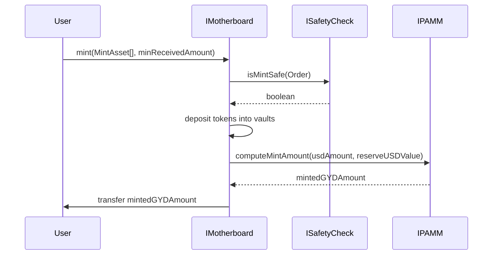

import { Callout, Steps, Step } from "nextra-theme-docs";

# Minting Flow

The minting process in the Gyroscope protocol is a crucial operation that allows users to deposit tokens into the reserve and receive Gyroscope Dollars (GYD) in return. This section outlines the key steps involved in the minting process.

## Prepare the Order

Before initiating a mint, the user needs to prepare the necessary information for the `mint` function call. This includes:

1. **Mint Assets**: The user specifies the tokens they want to deposit, along with the corresponding amounts and the destination vaults for those tokens.
2. **Minimum Received Amount**: The user sets the minimum amount of GYD they expect to receive in return for their deposit.

<Callout type="info">
The `MintAsset` struct is used to represent the tokens, amounts, and destination vaults for the mint operation.
</Callout>

## Invoke the Mint Function

Once the order is prepared, the user can call the `mint` function on the `IMotherboard` contract. This function performs the following steps:

<Steps>
### Step 1

The `IMotherboard` contract checks the safety of the mint operation by calling the `ISafetyCheck` contract. This ensures that the proposed mint would not cause any issues with the protocol's state, such as unbalanced vaults or stablecoins deviating from their peg.

### Step 2

If the mint is deemed safe, the `IMotherboard` contract proceeds to execute the mint operation. It first deposits the user's tokens into the appropriate vaults, as specified in the `MintAsset` struct.

### Step 3

Next, the `IMotherboard` contract calls the `IPAMM` contract to compute the amount of GYD to mint based on the deposited tokens and the current state of the reserve.

### Step 4

The `IMotherboard` contract then mints the calculated GYD amount and transfers it to the user.
</Steps>

## Minting Workflow Diagram

The minting workflow can be represented by the following Mermaid diagram:

The above diagram illustrates the step-by-step process of the minting operation, including the interaction between the user, the `IMotherboard` contract, the `ISafetyCheck` contract, and the `IPAMM` contract.

## Conclusion

The minting flow in the Gyroscope protocol is designed to be secure and efficient. By checking the safety of the mint operation, depositing tokens into the appropriate vaults, and computing the correct amount of GYD to mint, the protocol ensures a smooth and reliable minting experience for users.

For more information on the other key components of the Gyroscope protocol, such as the redemption flow and the oracle integration, please refer to the [Architecture and Interactions](/architecture-interactions) section.