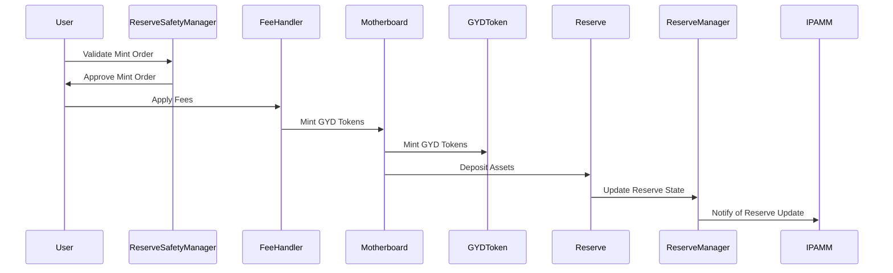

import { Callout, Steps, Step } from "nextra-theme-docs";

# Minting Flow

The minting flow in the Gyroscope protocol is a crucial process that allows users to convert their assets into the protocol's native token, the Gyro Dollar (GYD). This flow involves several steps and interactions between the core Gyroscope contracts, ensuring the integrity and safety of the minting process.

## Overview

The minting process begins when a user initiates a mint operation, providing the necessary assets and specifying the desired amount of GYD to be minted. The Gyroscope protocol then orchestrates the following steps to execute the mint:

<Steps>
### Step 1: Validating the Mint Order

The mint order is first validated by the [ReserveSafetyManager](/isafety-check/isafety-check) contract. This contract checks the following:

- The asset prices are within acceptable ranges, ensuring that the mint operation will not introduce significant price distortions.
- The resulting weights of the vaults in the reserve are within the allowed deviation from their ideal weights, or that the operation will move the weights closer to the ideal.
- The stablecoins in the reserve are all trading within an acceptable range of their target peg.

If the mint order is deemed safe, the validation process proceeds to the next step.

### Step 2: Applying Fees

The [IFeeHandler](/core-contracts/ifee-handler) contract is then called to apply any applicable fees to the mint operation. These fees can be used for various purposes, such as funding protocol development, providing incentives, or maintaining the stability of the system.

### Step 3: Minting GYD Tokens

Once the order has been validated and the fees have been applied, the [IMotherboard](/core-contracts/imotherboard) contract is called to perform the actual minting of GYD tokens. This contract interacts with the [IGYDToken](/core-contracts/igyd-token) contract to mint the requested amount of GYD tokens and allocate them to the user's address.

### Step 4: Depositing Assets into the Reserve

The assets provided by the user for the mint operation are then deposited into the [IReserve](/core-contracts/ireserve) contract. This contract manages the protocol's reserve of tokens, which is used to back the GYD tokens and provide liquidity for various operations.

### Step 5: Updating the Reserve State

Finally, the [IReserveManager](/core-contracts/ireserve-manager) contract is called to update the state of the reserve, including the new balances of the vaults and the overall reserve value. This information is used by other components of the Gyroscope protocol, such as the [IPAMM](/core-contracts/ipamm) contract, to maintain accurate pricing and redemption calculations.
</Steps>

The minting flow can be visualized using the following mermaid diagram:

The minting flow is a crucial part of the Gyroscope protocol, as it allows users to convert their assets into the protocol's native token, the Gyro Dollar (GYD). By following this flow, the protocol ensures the safety and integrity of the minting process, maintaining the stability and trustworthiness of the GYD token.