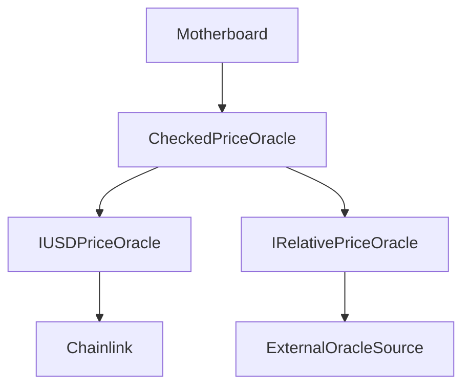

import { Callout, Steps, Step } from "nextra-theme-docs";

# Oracle Integration

The Gyroscope protocol relies on a robust set of oracles to obtain accurate and reliable price information for the assets in the reserve. The oracle integration in Gyroscope is designed to ensure that the protocol's pricing mechanisms are grounded in real-world market data, mitigating the risks of price manipulation and stale prices.

## Checked Price Oracle

At the core of the oracle integration is the `CheckedPriceOracle` contract. This oracle performs a series of checks on the retrieved asset prices to ensure their validity and consistency. The key features of the `CheckedPriceOracle` include:

1. **Chainlink Integration**: The `CheckedPriceOracle` uses the Chainlink oracle as the primary source of USD prices for the assets in the reserve.
2. **Relative Price Checks**: The oracle also integrates with a `RelativePriceOracle` to verify the consistency of the relative prices between assets. This helps detect any potential price deviations or inconsistencies.
3. **Price Level Checks**: The oracle performs checks on the overall price level of the reserve, ensuring that the WETH/USD price is grounded and consistent with trusted external price feeds.
4. **Sigma Weighted Median**: To compute a robust WETH/USD price, the oracle calculates a sigma weighted median of the prices from trusted external price sources.

The `CheckedPriceOracle` contract is designed to be highly configurable, allowing the protocol governance to manage the set of trusted price sources, the relative price epsilon, and other parameters.

<Callout type="info">
The `CheckedPriceOracle` is a key component of the Gyroscope protocol, ensuring that the pricing mechanisms are backed by reliable and consistent market data. Its robust design helps mitigate the risks of price manipulation and stale prices, which are critical for the overall stability and security of the protocol.
</Callout>

## Oracle Interactions

The oracle integration in Gyroscope can be visualized using the following mermaid diagram:

1. The `Motherboard` contract, which is the central entry point for the protocol, interacts with the `CheckedPriceOracle` to obtain the latest asset prices.
2. The `CheckedPriceOracle` relies on two interfaces: `IUSDPriceOracle` and `IRelativePriceOracle`.
3. The `IUSDPriceOracle` interface is implemented by the Chainlink oracle, which provides the USD prices for the assets.
4. The `IRelativePriceOracle` interface is implemented by an external oracle source, which provides the relative prices between asset pairs.

The `CheckedPriceOracle` performs the necessary checks and computations to ensure the consistency and reliability of the retrieved prices, before providing the final prices to the `Motherboard`.

<Callout type="warning">
It is crucial to carefully select and monitor the oracle sources integrated into the Gyroscope protocol, as they play a critical role in the overall security and stability of the system. Regular audits and governance oversight are essential to ensure the continued reliability of the oracle integration.
</Callout>

## Price Retrieval Workflow

The process of retrieving prices in the Gyroscope protocol can be summarized in the following steps:

<Steps>
### Step 1

The `Motherboard` contract calls the `CheckedPriceOracle` to retrieve the latest asset prices for the tokens in the reserve.

### Step 2

The `CheckedPriceOracle` contract fetches the USD prices for the assets from the `IUSDPriceOracle` (Chainlink) and the relative prices between asset pairs from the `IRelativePriceOracle`.

### Step 3

The `CheckedPriceOracle` performs a series of checks on the retrieved prices, including:
- Verifying the consistency of the relative prices
- Ensuring the WETH/USD price is grounded and consistent with trusted external price feeds
- Calculating a sigma weighted median of the prices from trusted external sources

### Step 4

The `CheckedPriceOracle` returns the validated and processed prices to the `Motherboard` contract, which can then use this information for various protocol operations, such as minting, redeeming, and swapping.
</Steps>

By following this robust price retrieval workflow, the Gyroscope protocol ensures that its pricing mechanisms are based on accurate and reliable market data, contributing to the overall stability and security of the system.

For more information on the specific implementation details of the oracles, please refer to the [Oracles](/oracles) section of the documentation.