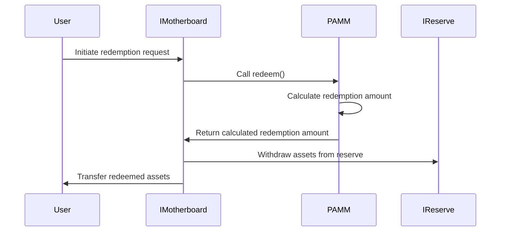

import { Callout, Steps, Step } from "nextra-theme-docs";

# Redemption Flow

The redemption flow in the Gyroscope protocol describes the sequence of interactions that occur when a user wants to redeem their Gyro Dollars (GYD) tokens for the underlying assets. This process involves several key components of the protocol, including the [PAMM](/core-contracts/pamm), [IReserve](/core-contracts/ireserve), and [IMotherboard](/core-contracts/imotherboard) contracts.

## Overview of the Redemption Process

The redemption process in Gyroscope allows users to exchange their GYD tokens for the underlying assets held in the protocol's reserve. This reserve is composed of various vaults, each of which holds a specific set of tokens. When a user initiates a redemption, the protocol calculates the appropriate amount of each token that the user should receive, based on the current state of the reserve and the [PAMM](/core-contracts/pamm) pricing mechanism.

<Callout type="info">
The [PAMM](/core-contracts/pamm) (Primary Automated Market Maker) is the core pricing contract in the Gyroscope protocol, responsible for determining the redemption values.
</Callout>

The overall redemption flow can be summarized as follows:

1. The user initiates a redemption request through the [IMotherboard](/core-contracts/imotherboard) contract, specifying the amount of GYD they wish to redeem.
2. The [IMotherboard](/core-contracts/imotherboard) contract calls the [redeem()](/core-contracts/pamm#redeem) function on the [PAMM](/core-contracts/pamm) contract, passing in the user's redemption request.
3. The [PAMM](/core-contracts/pamm) contract calculates the appropriate redemption amount for the user, based on the current state of the reserve and the [PAMM](/core-contracts/pamm) pricing model.
4. The [PAMM](/core-contracts/pamm) contract records the updated redemption level and last redemption block, and returns the calculated redemption amount to the [IMotherboard](/core-contracts/imotherboard) contract.
5. The [IMotherboard](/core-contracts/imotherboard) contract then withdraws the appropriate assets from the [IReserve](/core-contracts/ireserve) contract and transfers them to the user.

<Callout type="info">
The [ISafetyCheck](/core-contracts/isafety-check) contract is also involved in the redemption process, ensuring that the operation is safe and does not violate any protocol constraints.
</Callout>

## Detailed Redemption Flow

Let's dive into the detailed steps of the redemption flow:

<Steps>
### Step 1: User Initiates Redemption Request

The user interacts with the [IMotherboard](/core-contracts/imotherboard) contract to initiate a redemption request. They specify the amount of GYD they wish to redeem, as well as the output tokens they would like to receive.

### Step 2: IMotherboard Calls PAMM's redeem()

The [IMotherboard](/core-contracts/imotherboard) contract calls the [redeem()](/core-contracts/pamm#redeem) function on the [PAMM](/core-contracts/pamm) contract, passing in the user's redemption request.

### Step 3: PAMM Calculates Redemption Amount

The [PAMM](/core-contracts/pamm) contract calculates the appropriate redemption amount for the user, based on the current state of the reserve and the [PAMM](/core-contracts/pamm) pricing model. This involves the following steps:

1. The [PAMM](/core-contracts/pamm) contract retrieves the current state of the reserve, including the redemption level, reserve value, and total Gyro Dollar supply, by calling the [computeStartingRedeemState()](/core-contracts/pamm#computeStartingRedeemState) function.
2. The [PAMM](/core-contracts/pamm) contract then calls the [computeRedeemAmount()](/core-contracts/pamm#computeRedeemAmount) function, passing in the current reserve state and the user's requested redemption amount. This function calculates the appropriate redemption amount, taking into account the [PAMM](/core-contracts/pamm) pricing model and any constraints on the redemption process.

### Step 4: PAMM Updates Redemption State

After calculating the redemption amount, the [PAMM](/core-contracts/pamm) contract updates the redemption level and last redemption block, and returns the calculated redemption amount to the [IMotherboard](/core-contracts/imotherboard) contract.

### Step 5: IMotherboard Withdraws Assets from IReserve

The [IMotherboard](/core-contracts/imotherboard) contract then withdraws the appropriate assets from the [IReserve](/core-contracts/ireserve) contract, based on the redemption amount calculated by the [PAMM](/core-contracts/pamm) contract.

### Step 6: IMotherboard Transfers Assets to User

Finally, the [IMotherboard](/core-contracts/imotherboard) contract transfers the redeemed assets to the user, completing the redemption process.
</Steps>

The redemption flow ensures that users can efficiently redeem their GYD tokens for the underlying assets held in the Gyroscope reserve, while maintaining the integrity of the protocol's pricing mechanisms and reserve management.

For more information on the [PAMM](/core-contracts/pamm) contract and its pricing model, refer to the [PAMM section](/core-contracts/pamm). For details on the [IReserve](/core-contracts/ireserve) and [IMotherboard](/core-contracts/imotherboard) contracts, please consult their respective sections.