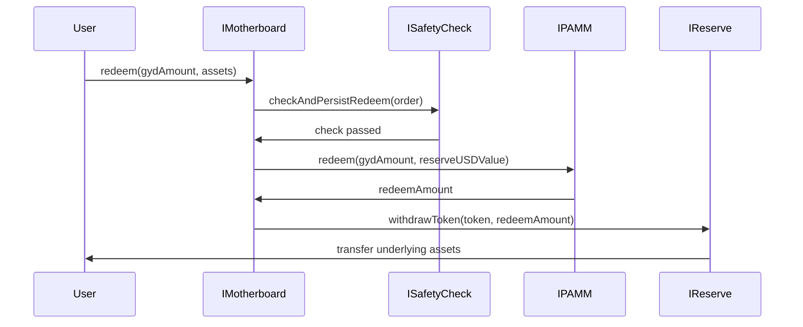

import { Callout, Steps, Step } from "nextra-theme-docs";

# Redemption Flow

The redemption flow in the Gyroscope protocol is the process by which users can convert their Gyro Dollars (GYD) tokens back into the underlying assets deposited into the Gyroscope reserve. This flow is orchestrated by the **IMotherboard** contract, which serves as the central coordinator for the various components of the Gyroscope protocol.

## Steps to Redeem GYD

<Steps>
### Step 1: Initiate Redemption

The user calls the `redeem` function on the **IMotherboard** contract, providing the amount of GYD tokens they wish to redeem and the target assets they want to receive. The **IMotherboard** contract then performs a series of checks and validations to ensure the redemption request is safe and feasible.

### Step 2: Safety Checks

The **IMotherboard** contract delegates the safety checks to the **ISafetyCheck** contract, which examines the current state of the Gyroscope reserve and ensures that the redemption request will not unbalance the protocol or cause any other issues. This includes verifying that the requested redemption amount does not exceed the available liquidity in the reserve, and that the resulting weights of the vaults will remain within acceptable ranges.

<Callout type="info">
The **ISafetyCheck** contract performs a series of checks, including verifying that the requested redemption amount can be satisfied by the current reserve balances, and that the resulting weights of the vaults will not deviate too far from their target weights.
</Callout>

### Step 3: Redemption Calculation

If the safety checks pass, the **IMotherboard** contract then calls the `redeem` function on the **IPAMM** contract, which is responsible for calculating the amount of underlying assets the user should receive in exchange for their GYD tokens. This calculation is performed based on the current state of the Gyroscope reserve and the system parameters defined in the **PAMM** contract.

### Step 4: Asset Withdrawal

Once the redemption amount has been calculated, the **IMotherboard** contract withdraws the necessary assets from the **IReserve** contract and transfers them to the user. The user then receives the requested underlying assets in exchange for their GYD tokens.
</Steps>

The redemption flow can be visualized using the following mermaid diagram:

The redemption flow ensures that the Gyroscope protocol maintains a healthy and balanced state, even as users redeem their GYD tokens for the underlying assets. By integrating the **PAMM**, **ISafetyCheck**, and **IReserve** contracts, the **IMotherboard** contract is able to manage the redemption process in a secure and efficient manner.