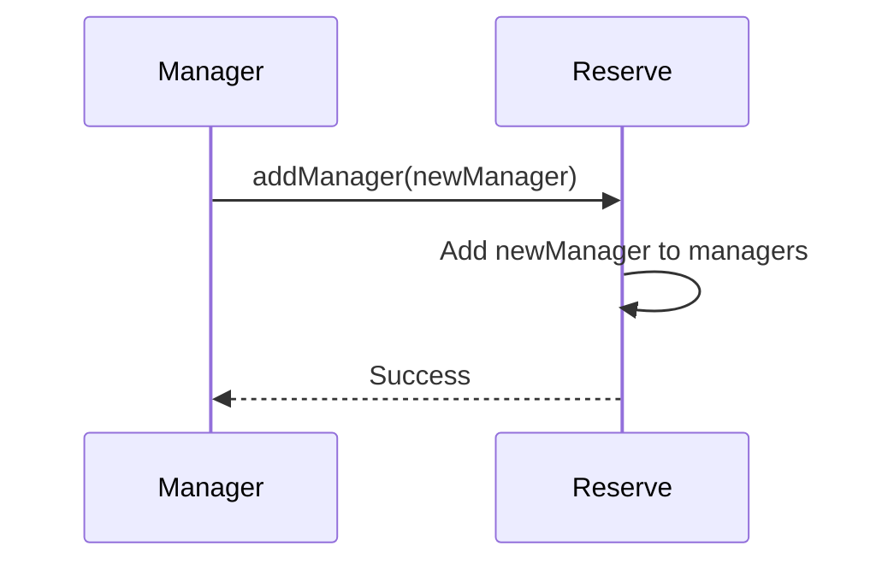

import { Callout, Steps, Step } from "nextra-theme-docs";

# IReserve

The `IReserve` contract is the interface for the Gyroscope protocol's reserve, which manages the depositing and withdrawing of tokens. This is a critical component of the protocol, as it is responsible for holding the underlying assets that back the Gyro stablecoin.

The `IReserve` interface defines the following key functionalities:

## Deposit and Withdraw Tokens
The reserve allows authorized accounts, known as _managers_, to deposit and withdraw tokens from the reserve. This is done through the `depositToken` and `withdrawToken` functions.

<Callout type="info">
The reserve only allows deposits and withdrawals from authorized managers to ensure the integrity of the reserve's holdings.
</Callout>

## Manager Management
The `IReserve` contract allows adding and removing reserve managers through the `addManager` and `removeManager` functions. Only the current managers are allowed to perform these operations.

## Events
The `IReserve` contract emits the following events:

- `Deposit`: Emitted when tokens are deposited into the reserve.
- `Withdraw`: Emitted when tokens are withdrawn from the reserve.
- `ManagerAdded`: Emitted when a new manager is added.
- `ManagerRemoved`: Emitted when a manager is removed.

These events allow external systems to track the activities and changes happening within the reserve.

## Example Usage
Here's an example of how the `IReserve` contract might be used in the Gyroscope protocol:

<Steps>
### Step 1
A Gyroscope user requests to mint some Gyro tokens. The Motherboard contract calls the `mint` function on the `IReserve` contract to deposit the necessary tokens into the reserve.

### Step 2
The Motherboard contract calls the `depositToken` function on the `IReserve` contract, passing the token address and the amount to be deposited. The `IReserve` contract ensures that the caller is an authorized manager and then updates the reserve's holdings accordingly.

### Step 3
When a user requests to redeem Gyro tokens, the Motherboard contract calls the `redeem` function on the `IReserve` contract to withdraw the corresponding underlying tokens from the reserve.

### Step 4
The Motherboard contract calls the `withdrawToken` function on the `IReserve` contract, passing the token address and the amount to be withdrawn. The `IReserve` contract ensures that the caller is an authorized manager and then updates the reserve's holdings accordingly.
</Steps>

The `IReserve` contract is a crucial part of the Gyroscope protocol, ensuring the secure management of the underlying assets that back the Gyro stablecoin. Its well-defined interface and events provide a standardized way for other Gyroscope components to interact with the reserve.