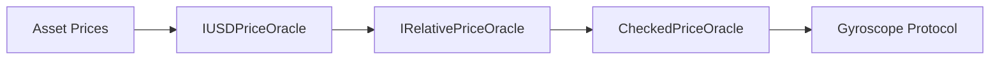

import { Callout, Steps, Step } from "nextra-theme-docs";

# Oracles

The Gyroscope protocol relies on various oracle contracts to fetch and verify the prices of assets used in the minting and redemption processes. These oracles provide crucial price information that ensures the protocol's stability and fairness.

## Oracle Integration

The Gyroscope protocol integrates with multiple oracle sources to retrieve asset prices. This multi-oracle approach helps mitigate risks associated with relying on a single source of price data. The protocol uses the following key oracle interfaces:

- **IUSDPriceOracle**: Provides the USD price of a given asset.
- **IRelativePriceOracle**: Provides the relative price between a pair of assets.
- **CheckedPriceOracle**: A wrapper around the USD and relative price oracles, performing additional checks to ensure the prices are accurate and consistent.

The oracle integration is designed to be flexible, allowing the protocol to easily switch out or add new oracle sources as needed. This helps the protocol adapt to changes in the DeFi ecosystem and maintain the integrity of its price feeds.

<Callout type="info">
The Gyroscope protocol's use of multiple oracle sources and extensive price validation helps ensure the stability and reliability of its minting and redemption processes.
</Callout>

The overall flow of the oracle integration can be visualized as follows:

The `CheckedPriceOracle` contract acts as the primary interface for the protocol, consolidating the price information from the underlying oracles and performing additional checks to ensure the prices are accurate and consistent.

<Callout type="warning">
The Gyroscope protocol's reliance on oracle data means it is important to carefully monitor the health and reliability of the oracle sources. Sudden changes or inaccuracies in the oracle prices could potentially impact the stability of the protocol.
</Callout>

In the following sections, we will explore the key oracle contracts used in the Gyroscope protocol in more detail.

[CheckedPriceOracle](/oracles/checked-price-oracle)
[IUSDPriceOracle](/oracles/iusd-price-oracle)
[IRelativePriceOracle](/oracles/irelative-price-oracle)