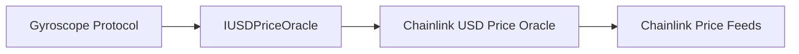

import { Callout, Steps, Step } from "nextra-theme-docs";

# IUSDPriceOracle

The `IUSDPriceOracle` is a critical component in the Gyroscope protocol, responsible for providing accurate and reliable USD pricing information for the various assets supported in the system. This oracle interface ensures that the Gyroscope's [PAMM (PrimaryAMMV1)](/core-contracts/pamm) contract can perform its pricing calculations based on trusted USD prices.

The `IUSDPriceOracle` interface defines a single function, `getPriceUSD`, which takes an asset address as input and returns the corresponding USD price for that asset. This price is always scaled with 18 decimals, regardless of the source used for the oracle.

<Callout type="info">
The Gyroscope protocol relies on the USD prices provided by the `IUSDPriceOracle` to perform crucial operations such as minting and redemption of the Gyro Dollar (GYD) token. Ensuring the accuracy and reliability of these price feeds is of utmost importance for the protocol's stability and user confidence.
</Callout>

## Implementing the `IUSDPriceOracle` Interface

To integrate with the Gyroscope protocol, a contract must implement the `IUSDPriceOracle` interface. This means providing a `getPriceUSD` function that can accurately retrieve the USD price for a given asset address.

<Steps>
### Step 1: Fetch the USD Price from a Trusted Source
The implementation of the `getPriceUSD` function should fetch the USD price for the input asset from a reliable and trusted source, such as Chainlink or a custom oracle solution. This price feed should be constantly monitored and updated to ensure the prices remain accurate and up-to-date.

### Step 2: Scale the Price to 18 Decimals
The Gyroscope protocol expects the USD prices to be provided with 18 decimal places, so the implementation should ensure that the retrieved price is scaled accordingly. This can be done using the `FixedPoint` library provided in the Gyroscope codebase, or a similar fixed-point arithmetic library.

### Step 3: Return the Scaled Price
Finally, the `getPriceUSD` function should return the scaled USD price for the input asset address.
</Steps>

By implementing the `IUSDPriceOracle` interface, you can seamlessly integrate your price feed into the Gyroscope protocol and ensure that the Gyro Dollar's pricing mechanisms have access to accurate and reliable USD prices.

## Integrating the `IUSDPriceOracle` into the Gyroscope Protocol

The Gyroscope protocol's [PAMM (PrimaryAMMV1)](/core-contracts/pamm) contract uses the `IUSDPriceOracle` to perform its pricing calculations. The PAMM contract calls the `getPriceUSD` function to retrieve the current USD price for each asset involved in a minting or redemption operation.

<Callout type="info">
It's important to note that the `IUSDPriceOracle` is just one component of the Gyroscope protocol's oracle integration. The protocol also utilizes an [IRelativePriceOracle](/oracles/irelative-price-oracle) to provide relative pricing information between asset pairs.
</Callout>

By integrating a reliable `IUSDPriceOracle` implementation, you can ensure that the Gyroscope protocol's pricing mechanisms are based on accurate and up-to-date USD prices, contributing to the overall stability and reliability of the Gyro Dollar.

## Example Implementation: Chainlink USD Price Oracle

One example implementation of the `IUSDPriceOracle` could be a contract that fetches USD prices from the Chainlink network. Here's a high-level overview of how such an implementation might look:

The Chainlink USD Price Oracle contract would have the following key components:

- A function to fetch the latest USD price for a given asset from the Chainlink Price Feeds
- Logic to scale the retrieved price to 18 decimal places
- An implementation of the `getPriceUSD` function from the `IUSDPriceOracle` interface

This implementation would allow the Gyroscope protocol to leverage the trusted and reliable price feeds provided by the Chainlink network, ensuring that the Gyro Dollar's pricing mechanisms are based on accurate and up-to-date information.

By integrating a well-designed `IUSDPriceOracle` implementation, the Gyroscope protocol can maintain the stability and reliability of the Gyro Dollar, providing users with a trustworthy decentralized stablecoin.